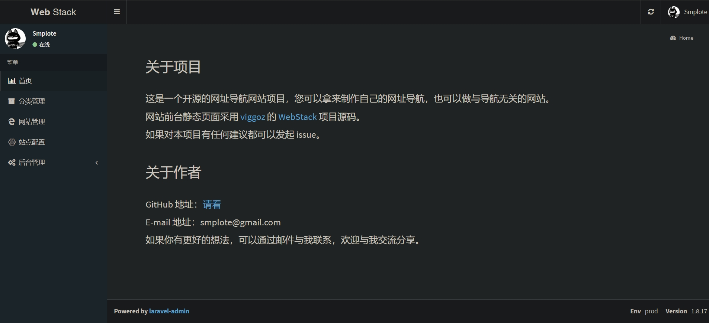
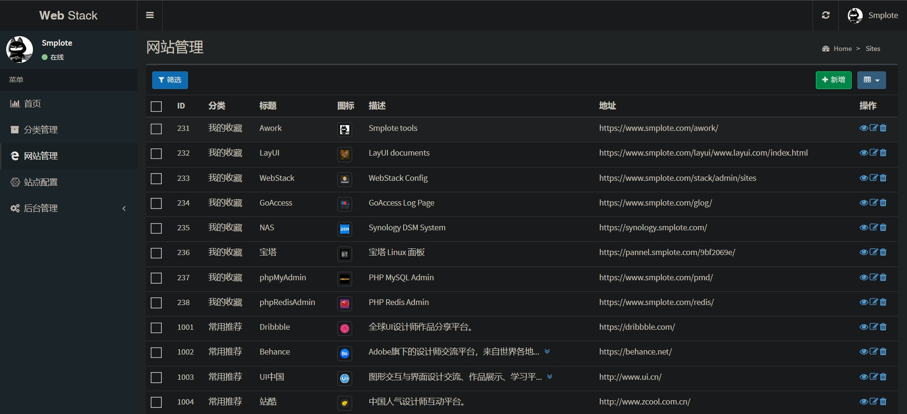

# WebStack-Laravel

> 个人版更新内容；
 - 解决各种资源加载 404 问题
 - 解决 admin 后台反复重定向问题
 - https | http 访问配置化
 - 支持 nginx 反向代理 (重点改造)
 - 免 composer install (composer 2.x 已不能正常安装)

一个开源的网址导航网站项目，具备完整的前后台，您可以拿来制作自己的网址导航。


## 部署

克隆代码：

```shell
git clone https://gitee.com/mounten2657/web_stack.git
```

安装依赖：

```shell
$ composer install
```

编辑配置：

```
$ cp .env.example .env
```

```
...
DB_DATABASE=database
DB_USERNAME=username
DB_PASSWORD=password
...
```

生成 KEY：

```shell
$ php artisan key:generate  
```

迁移数据：

```shell
php artisan migrate:refresh --seed

# 或直接执行 database 下的 web_stack.sql
```

> 以下步骤非必须，建议用 nginx 新建项目访问

本地测试：

```shell
$ php artisan serve
```

安装完成：http://127.0.0.1:8000

> 有些朋友对部署表示有压力，但这和一般的 Laravel 应用是没有区别的，线上环境可以参考：https://github.com/summerblue/laravel-ubuntu-init


## 使用

后台地址：http://127.0.0.1:8000/admin

默认用户：admin

默认密码：admin







## 其他

本应用预设了一些站点数据，可以使用以下命令清除：

```shell
$ php artisan webstack:clean
```


## 感谢

前端设计：[**WebStackPage**](https://github.com/WebStackPage/WebStackPage.github.io)

后台框架：[**laravel-admin**](https://github.com/z-song/laravel-admin)


## License
 - 这个项目免费开源，不存在收费。
 - 本工具仅供学习和技术研究使用，不得用于任何商业或非法行为。
 - 本工具的作者不对本工具的安全性、完整性、可靠性、有效性、正确性或适用性做任何明示或暗示的保证，也不对本工具的使用或滥用造成的任何直接或间接的损失、责任、索赔、要求或诉讼承担任何责任。
 - 本工具的作者保留随时修改、更新、删除或终止本工具的权利，无需事先通知或承担任何义务。
 - 本工具的使用者应遵守相关法律法规，尊重微信的版权和隐私，不得侵犯微信或其他第三方的合法权益，不得从事任何违法或不道德的行为。
 - 本工具的使用者在下载、安装、运行或使用本工具时，即表示已阅读并同意本免责声明。如有异议，请立即停止使用本工具，并删除所有相关文件。
 - 代码仅用于对技术的交流学习使用，禁止用于实际生产项目，请勿用于非法用途和商业用途！如因此产生任何法律纠纷，均与作者无关！


